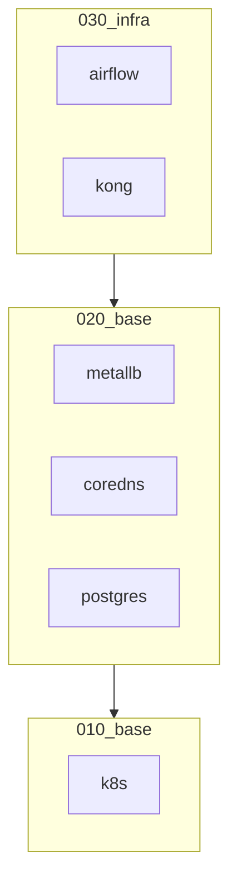

# Infra

## Getting Started

### DNS

```
# /etc/systemd/resolve.conf
[Resolve]
DNS=172.20.0.100
Domains=kind
```

* Restart computer or `sudo systemctl restart systemd-resolved`

### Running

Run terraform in each terrafor/* subdir in order.

Ex:
```bash
cd terraform/010_k8s
terraform apply -auto-approve
```

## Services

* airflow.kind
* db.internal (postgres)


## Architecture

