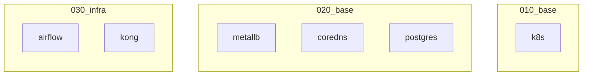

# Infra

## Getting dns working

```
# /etc/systemd/resolve.conf
[Resolve]
DNS=172.20.0.100
Domains=kind
```

* Restart computer or `sudo systemctl restart systemd-resolved`

## Services

* airflow.kind
* db.internal (postgres)


## Architecture

